# Analisis & Kontrol Suspensi Aktif Quarter-Car


Pemodelan *state-space* sistem suspensi aktif seperempat mobil (2-DOF) dengan parameter **BMW 530i**, analisis *controllability*/*observability*, serta perbandingan beberapa strategi kontrol berbasis LQR: **LQR**, **LQR-PID**, dan **Internal Model Principle (IMP)**. Bobot $Q$ dan $R$ dicari otomatis dengan **Genetic Algorithm (GA)**. Pendekatan **Pontryagin's Maximum Principle (PMP)** dan **Reinforcement Learning (RL)** masih dikerjakan.

> Tugas mata kuliah **TF4108 Pembelajaran Mesin untuk Kontrol**, Program Studi Teknik Fisika, Institut Teknologi Bandung (2024).
> Achriza Nurfarid (13321023) · Izma Alhazmi Herdian (13321027) · Ilham Bintang (13321047)

<p align="center">
  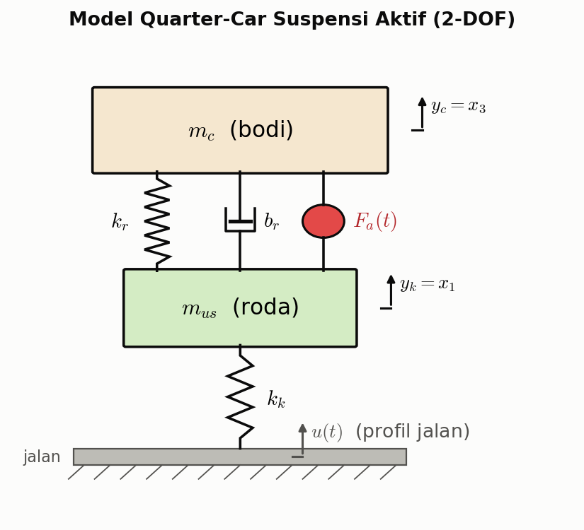
</p>

---

## Daftar Isi

1. [Struktur Repository](#struktur-repository)
2. [Pemodelan Sistem](#1-pemodelan-sistem)
3. [Analisis Sistem Open-Loop](#2-analisis-sistem-open-loop)
4. [Metode Kontrol](#3-metode-kontrol)
5. [Hasil](#4-hasil)
6. [Cara Menjalankan](#5-cara-menjalankan)
7. [Catatan & Keterbatasan](#6-catatan--keterbatasan)
8. [Referensi](#7-referensi)

---

## Struktur Repository

```
AnalysisQuarterCarSuspension/
├── 01_LQR/              # LQR baseline vs LQR yang bobotnya dioptimasi GA
│   ├── FindLQR.m        #   script utama: model → GA → lqr() → simulasi Simulink → plot
│   ├── GA.m             #   versi tanpa Simulink (ode45) + validasi stabilitas
│   └── CariLQR.slx      #   model Simulink
├── 03_LQR_PID/          # MIMO-PID yang ditala dari gain LQR (augmentasi integral)
│   ├── FindLQR_PID.m
│   └── CariLQR_PID.slx
├── 04_PMP/              # Pontryagin's Maximum Principle (WIP)
│   ├── FindPMP.m
│   └── CariPMP.slx
├── 05_IMP/              # Internal Model Principle + LQR
│   ├── FindIMP.m
│   └── CariIMP.slx
├── 06_RL/               # Reinforcement Learning (WIP, baru model Simulink)
│   └── FindRL.slx
├── docs/
│   ├── Report.pdf       # laporan lengkap (pemodelan, observability, LQR)
│   ├── images/          # semua gambar di README
│   └── scripts/
│       └── generate_figures.py   # membuat ulang gambar ilustrasi README
└── references/          # jurnal & materi rujukan
```

---

## 1. Pemodelan Sistem

### 1.1 Persamaan gerak

Sistem terdiri dari massa bodi $m_c$ (*sprung mass*) dan massa roda $m_{us}$ (*unsprung mass*). Keduanya dihubungkan oleh pegas $k_r$, peredam $b_r$, dan aktuator $F_a$. Roda menapak jalan melalui kekakuan ban $k_k$ dengan eksitasi profil jalan $u(t)$. Dengan hukum Newton II:

```math
\begin{aligned}
m_{us}\,\ddot y_k &= k_k\,(u - y_k) - k_r\,(y_k - y_c) - b_r\,(\dot y_k - \dot y_c) - F_a \\
m_c\,\ddot y_c &= k_r\,(y_k - y_c) + b_r\,(\dot y_k - \dot y_c) + F_a
\end{aligned}
```

### 1.2 Representasi state-space

Variabel keadaan yang dipilih:

```math
x = \begin{bmatrix} x_1 \\ x_2 \\ x_3 \\ x_4 \end{bmatrix}
  = \begin{bmatrix} y_k \\ \dot y_k \\ y_c \\ \dot y_c \end{bmatrix},
\qquad
\mathbf{u} = \begin{bmatrix} F_a \\ u \end{bmatrix}
```

sehingga $\dot x = Ax + B\mathbf{u}$, $\;y = Cx + D\mathbf{u}$ dengan

```math
A = \begin{bmatrix}
0 & 1 & 0 & 0 \\[2pt]
-\dfrac{k_k + k_r}{m_{us}} & -\dfrac{b_r}{m_{us}} & \dfrac{k_r}{m_{us}} & \dfrac{b_r}{m_{us}} \\[8pt]
0 & 0 & 0 & 1 \\[2pt]
\dfrac{k_r}{m_c} & \dfrac{b_r}{m_c} & -\dfrac{k_r}{m_c} & -\dfrac{b_r}{m_c}
\end{bmatrix},
\quad
B = \begin{bmatrix}
0 & 0 \\[2pt]
-\dfrac{1}{m_{us}} & \dfrac{k_k}{m_{us}} \\[8pt]
0 & 0 \\[2pt]
\dfrac{1}{m_c} & 0
\end{bmatrix},
\quad
C = \begin{bmatrix} 0 & 0 & 1 & 0 \\ 0 & 0 & 0 & 1 \end{bmatrix}
```

Output yang dikontrol adalah perpindahan dan kecepatan bodi ($y_c$, $\dot y_c$), karena keduanya menentukan kenyamanan penumpang.

### 1.3 Parameter (BMW 530i)

| Parameter | Simbol | Depan | Belakang | Satuan |
|---|:---:|---:|---:|:---:|
| Kekakuan pegas suspensi | $k_r$ | 30 | 31.5 | kN/m |
| Koefisien redaman suspensi | $b_r$ | 1450 | 4000 | N·s/m |
| Kekakuan ban | $k_k$ | 340 | 340 | kN/m |
| Massa bodi (¼ kendaraan) | $m_c$ | 408 | 400 | kg |
| Massa roda | $m_{us}$ | 48.3 | 45 | kg |

Seluruh simulasi memakai parameter **bagian depan**. Dengan satuan SI, matriks numeriknya menjadi:

```math
A = \begin{bmatrix}
0 & 1 & 0 & 0 \\
-7660.46 & -30.02 & 621.12 & 30.02 \\
0 & 0 & 0 & 1 \\
73.53 & 3.55 & -73.53 & -3.55
\end{bmatrix},
\qquad
B = \begin{bmatrix}
0 & 0 \\
-0.0207 & 7039.34 \\
0 & 0 \\
0.00245 & 0
\end{bmatrix}
```

---

## 2. Analisis Sistem Open-Loop

### 2.1 Kestabilan & mode getar

Nilai eigen $A$ memperlihatkan dua mode osilasi teredam yang khas pada suspensi kendaraan:

| Mode | Pole $\lambda$ | $\omega_n$ | $f_n$ | $\zeta$ |
|---|:---:|:---:|:---:|:---:|
| Bodi (*body bounce*) | $-1.51 \pm 8.13j$ | 8.27 rad/s | **1.32 Hz** | 0.18 |
| Roda (*wheel hop*) | $-15.27 \pm 85.67j$ | 87.0 rad/s | **13.85 Hz** | 0.18 |

Semua pole berada di setengah bidang kiri ($\mathrm{Re}\{\lambda_i\}<0$), jadi sistem **stabil**. Namun rasio redamannya hanya ±0.18, sehingga respons berosilasi dengan overshoot ~60%.

### 2.2 Controllability & observability

```math
\mathcal{C} = \begin{bmatrix} B & AB & A^2B & A^3B \end{bmatrix},
\qquad
\mathcal{O} = \begin{bmatrix} C \\ CA \\ CA^2 \\ CA^3 \end{bmatrix}
```

Untuk input aktuator $F_a$ saja dan output $y_c$ saja ($C=[0\;0\;1\;0]$):

```math
\mathcal{C}_{F_a} =
\begin{bmatrix}
0 & -0.0207 & 0.6951 & 136.79 \\
-0.0207 & 0.6951 & 136.79 & -9450.66 \\
0 & 0.00245 & -0.0823 & 1.0603 \\
0.00245 & -0.0823 & 1.0603 & 539.52
\end{bmatrix},
\qquad
\mathcal{O}_{y_c} =
\begin{bmatrix}
0 & 0 & 1 & 0 \\
0 & 0 & 0 & 1 \\
73.53 & 3.55 & -73.53 & -3.55 \\
-27485.98 & -45.79 & 2468.72 & 45.79
\end{bmatrix}
```

$\mathrm{rank}(\mathcal{C}) = \mathrm{rank}(\mathcal{O}) = 4 = n$. Artinya sistem **controllable** (cukup dengan aktuator $F_a$) dan **observable** (cukup dengan mengukur $y_c$), sehingga *full-state feedback* layak diterapkan.

---

## 3. Metode Kontrol

### 3.1 Linear Quadratic Regulator (LQR) — [`01_LQR/`](01_LQR)

<p align="center">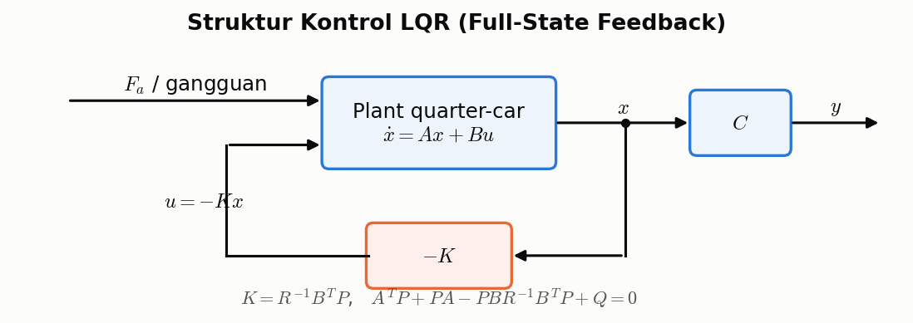</p>

LQR mencari hukum kontrol $u = -Kx$ yang meminimalkan indeks performa kuadratik

```math
J = \int_0^{\infty} \left( x^{T} Q\, x + u^{T} R\, u \right) dt ,
\qquad Q \succeq 0,\; R \succ 0
```

Solusinya diperoleh dari **Algebraic Riccati Equation (ARE)**:

```math
A^{T}P + PA - PBR^{-1}B^{T}P + Q = 0
\quad\Longrightarrow\quad
K = R^{-1}B^{T}P,
\qquad J^{*} = x_0^{T} P\, x_0
```

$Q$ menghukum penyimpangan *state*, sedangkan $R$ menghukum besarnya usaha kontrol. Semakin besar $Q/R$, respons semakin agresif dan usaha kontrolnya semakin besar.

#### Penalaan $Q$ & $R$ dengan Genetic Algorithm

Alih-alih coba-coba, diagonal $Q$ dan $R$ dicari dengan GA (`ga()` MATLAB, 1000 generasi, populasi 20, batas $q_i\in[0.1,100]$, $r_i\in[0.01,10]$):

<p align="center">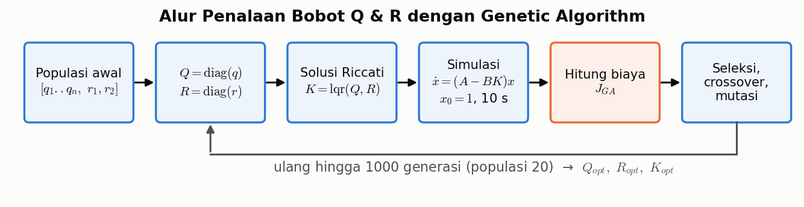</p>

Fungsi biaya GA menggabungkan ISE (*integral squared error*) dengan penalti karakteristik respons transien tiap *state*, disimulasikan dari $x_0 = [1\;1\;1\;1]^T$ selama 10 s:

```math
J_{GA} = \int_0^{10} \lVert x(t) \rVert^2 \, dt
\;+\; \sum_{i} \mathrm{OS}_i
\;+\; \sum_{i} t_{s,i}
\;+\; 100 \sum_{i} \lvert e_{ss,i} \rvert
```

dengan $\mathrm{OS}_i$ = *overshoot* (%), $t_{s,i}$ = *settling time* 2%, dan $e_{ss,i}$ = *steady-state error* dari *state* ke-$i$.

### 3.2 LQR-PID — [`03_LQR_PID/`](03_LQR_PID)

<p align="center">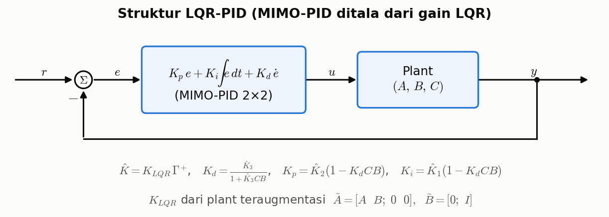</p>

Kontroler PID MIMO ditala menggunakan hasil LQR (He *et al.*, 2000; Kaci *et al.*, 2019). Plant diaugmentasi dengan integrator pada input (*backstepping integral*):

```math
\tilde A = \begin{bmatrix} A & B \\ 0 & 0 \end{bmatrix},\quad
\tilde B = \begin{bmatrix} 0 \\ I \end{bmatrix},\quad
\Gamma = \begin{bmatrix} C & 0 \\ CA & CB \\ CA^2 & CAB \end{bmatrix}
```

Gain LQR $K$ dari $(\tilde A,\tilde B,Q,R)$ dipetakan ke ruang output $\hat K = K\,\Gamma^{+}$, lalu dipecah menjadi $\hat K = [\hat K_1\;\hat K_2\;\hat K_3]$ untuk memperoleh gain PID:

```math
K_d = \frac{\hat K_3}{1 + \hat K_3\,CB}, \qquad
K_p = \hat K_2\,(1 - K_d\,CB), \qquad
K_i = \hat K_1\,(1 - K_d\,CB)
```

$Q$ (6×6) dan $R$ (2×2) juga dioptimasi dengan GA seperti pada 3.1.

### 3.3 Internal Model Principle (IMP) + LQR — [`05_IMP/`](05_IMP)

<p align="center">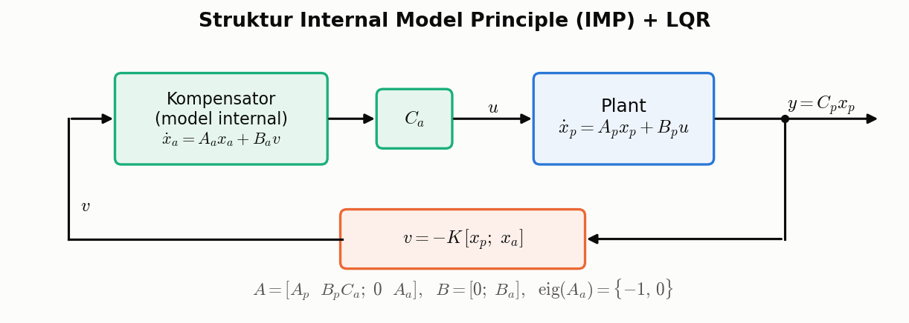</p>

Menurut *Internal Model Principle*, *tracking*/penolakan gangguan tanpa *steady-state error* dapat dicapai jika model pembangkit sinyal referensi/gangguan ikut ditanam di dalam loop. Kompensator orde-2 dengan nilai eigen $\{-1,\,0\}$ (memuat mode integrator) disusun dalam bentuk kanonik terkontrol:

```math
A_a = \begin{bmatrix} 0 & 1 \\ -a_0 & -a_1 \end{bmatrix},\quad
B_a = \begin{bmatrix} 0 & 0 \\ 1 & 1 \end{bmatrix},\quad
C_a = \begin{bmatrix} 1 & 1 \\ 1 & 1 \end{bmatrix},\quad
s^2 + a_1 s + a_0 = s(s+1)
```

Sistem teraugmentasi (6 *state*) lalu distabilkan dengan LQR (bobot dari GA):

```math
\begin{bmatrix} \dot x_p \\ \dot x_a \end{bmatrix}
= \underbrace{\begin{bmatrix} A_p & B_pC_a \\ 0 & A_a \end{bmatrix}}_{A}
\begin{bmatrix} x_p \\ x_a \end{bmatrix}
+ \underbrace{\begin{bmatrix} 0 \\ B_a \end{bmatrix}}_{B} v,
\qquad v = -K \begin{bmatrix} x_p \\ x_a \end{bmatrix}
```

### 3.4 Pontryagin's Maximum Principle (PMP) — [`04_PMP/`](04_PMP) *(WIP)*

Formulasi kontrol optimal via Hamiltonian:

```math
H(x,u,\lambda) = \tfrac12\left(x^{T}Qx + u^{T}Ru\right) + \lambda^{T}(Ax + Bu)
```

```math
\dot x = \frac{\partial H}{\partial \lambda},\qquad
\dot \lambda = -\frac{\partial H}{\partial x} = -Qx - A^{T}\lambda,\qquad
\frac{\partial H}{\partial u} = 0 \;\Rightarrow\; u^{*} = -R^{-1}B^{T}\lambda
```

Model Simulink `CariPMP.slx` sudah tersedia, tetapi `FindPMP.m` baru berisi definisi model dan bobot $Q$, $R$, $P$.

### 3.5 PID & Reinforcement Learning *(rencana)*

`06_RL/FindRL.slx` baru berupa kerangka model Simulink. PID murni belum diimplementasikan.

---

## 4. Hasil

### 4.1 LQR vs sistem tanpa kontrol (step response)

Reproduksi analisis di [`docs/Report.pdf`](docs/Report.pdf) dengan $Q=\mathrm{diag}(10,1,10,1)$ dan $R=\mathrm{diag}(100,100)$:

<p align="center">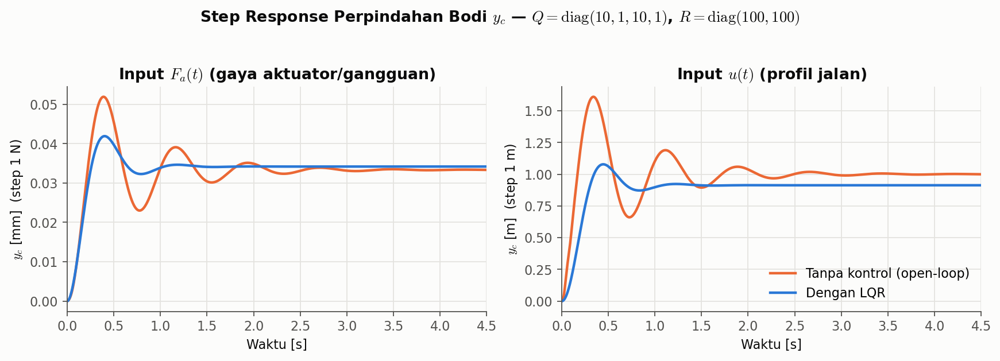</p>

| Input step → $y_c$ | Sistem | Overshoot | Settling time (2%) | Nilai akhir |
|---|---|:---:|:---:|:---:|
| Profil jalan $u$ (1 m) | Tanpa kontrol | 60.9 % | 2.39 s | 1.000 m |
| | **LQR** | **18.1 %** | **0.99 s** | 0.913 m |
| Gaya $F_a$ (1 N) | Tanpa kontrol | 55.6 % | 2.43 s | 0.0333 mm |
| | **LQR** | **22.6 %** | **0.96 s** | 0.0342 mm |

LQR memangkas overshoot sekitar 3× dan mempercepat *settling* sekitar 2.4×. Ada sedikit pergeseran nilai akhir (*offset*) karena LQR murni tidak memiliki aksi integral. Offset inilah yang menjadi motivasi pendekatan **LQR-PID** dan **IMP**.

### 4.2 Pergeseran pole

<p align="center">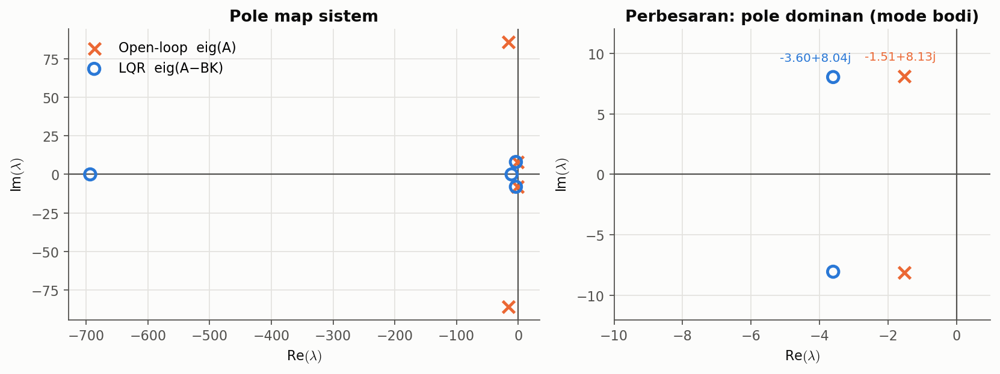</p>

Pole dominan bodi bergeser dari $-1.51 \pm 8.13j$ ($\zeta = 0.18$) ke $-3.60 \pm 8.04j$ ($\zeta = 0.41$). Frekuensi alaminya hampir tetap, tetapi redamannya naik lebih dari 2×. Mode roda (*wheel hop*) berubah menjadi dua pole real (−10.5 dan −694).

### 4.3 Transmisibilitas getaran jalan

<p align="center">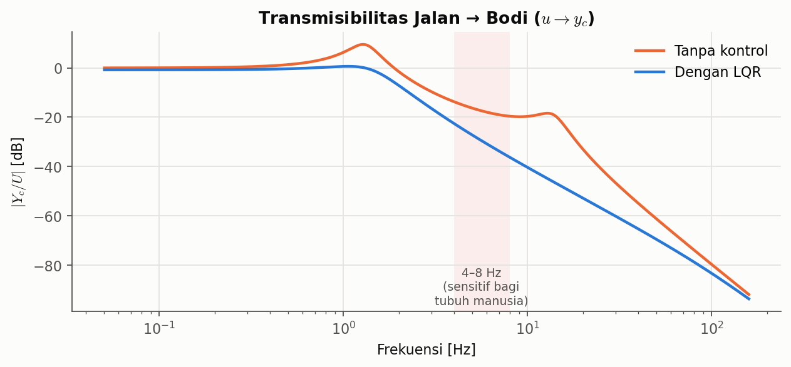</p>

LQR menghilangkan puncak resonansi bodi (~1.3 Hz, dari +9.4 dB menjadi ≈0 dB) dan resonansi roda (~14 Hz, dari −19 dB menjadi −46 dB). Pada rentang 4–8 Hz yang paling sensitif bagi tubuh manusia (ISO 2631), getaran yang diteruskan ke bodi turun sekitar 9–17 dB.

### 4.4 Pengaruh bobot $Q$ dan $R$

<p align="center">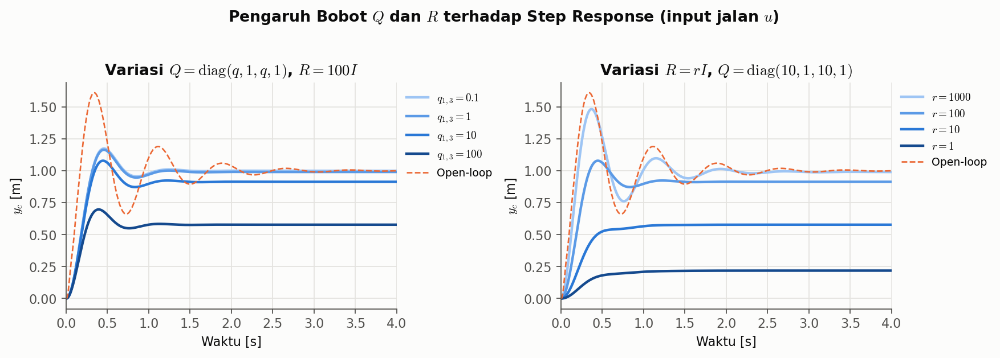</p>

- Menaikkan $Q$ (atau menurunkan $R$) membuat kontrol **lebih agresif**: overshoot turun dan osilasi cepat hilang, tetapi *offset* makin besar dan usaha kontrol makin tinggi.
- Yang menentukan respons adalah **rasio** $Q/R$. Karena itu, pasangan $\{Q=\mathrm{diag}(0.1,0.01,0.1,0.01),\,R=I\}$ dan $\{Q=\mathrm{diag}(10,1,10,1),\,R=100I\}$ di laporan menghasilkan plot yang serupa.

### 4.5 Hasil optimasi GA (simulasi Simulink)

Pada ketiga plot berikut, gangguan berupa pulsa satuan pada $t = 3\text{–}5$ s (analogi melewati polisi tidur). Garis **solid = baseline** ($Q=I$, $R=I$) dan garis **putus-putus = bobot hasil GA**.

**LQR vs LQR-GA** (`01_LQR/FindLQR.m`)
<p align="center">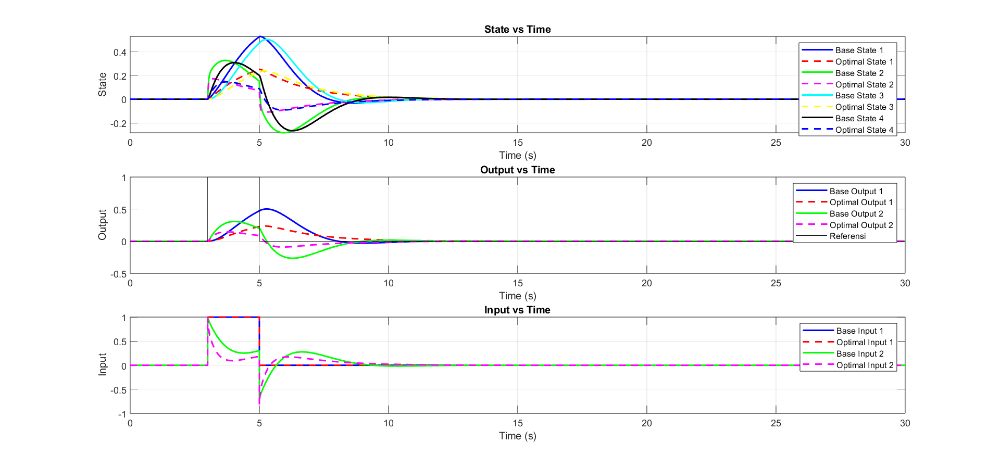</p>

Bobot hasil GA menurunkan puncak perpindahan bodi dari ≈0.5 menjadi ≈0.25 (sekitar −50%). Osilasi *state* setelah gangguan juga lebih kecil, dengan usaha kontrol yang sebanding.

**LQR-PID vs LQR-PID-GA** (`03_LQR_PID/FindLQR_PID.m`)
<p align="center"></p>

LQR-PID baseline berosilasi lambat dan belum *settle* dalam 30 s. Versi GA menekan deviasi *state* hingga mendekati nol. Lonjakan input ($\sim\!10^{10}$) muncul dari aksi derivatif terhadap tepi pulsa yang diskontinu. Masalah ini perlu diredam dengan filter derivatif ($N$) agar realistis.

**IMP vs IMP-GA** (`05_IMP/FindIMP.m`)
<p align="center">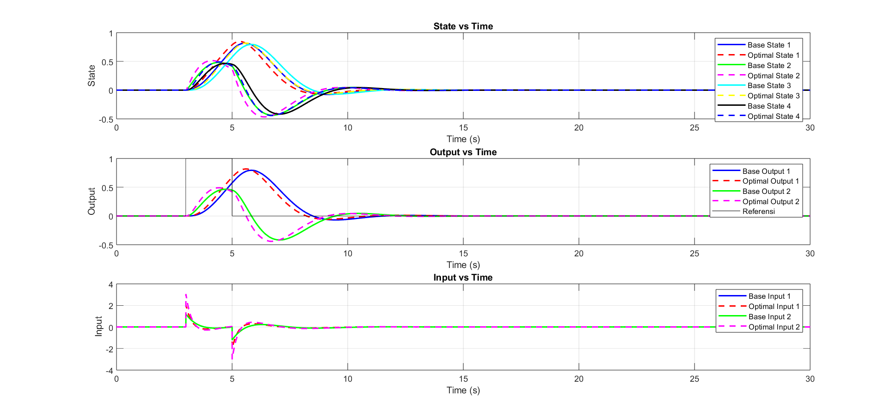</p>

IMP mengembalikan output ke nol tanpa *steady-state error* setelah gangguan. Versi GA sedikit lebih cepat, tetapi dengan puncak input yang lebih tinggi (≈3 vs ≈1.3).

---

## 5. Cara Menjalankan

### MATLAB

Kebutuhan: **MATLAB R2023b** (atau lebih baru) dengan toolbox berikut:

| Toolbox | Dipakai untuk |
|---|---|
| Simulink | model `Cari*.slx` |
| Control System Toolbox | `lqr`, `ss` |
| Global Optimization Toolbox | `ga` |
| Symbolic Math Toolbox | `jordan` (IMP) |

```matlab
cd 01_LQR
FindLQR        % GA → LQR → simulasi CariLQR.slx → plot
```

Script lain dijalankan dengan cara yang sama dari foldernya masing-masing: `03_LQR_PID/FindLQR_PID.m` dan `05_IMP/FindIMP.m`. Setiap script memanggil model Simulink di folder yang sama, jadi **current folder MATLAB harus berada di folder tersebut**.

> GA berjalan hingga 1000 generasi, sehingga prosesnya bisa memakan waktu lama. Kurangi `MaxGenerations` untuk uji cepat. GA juga bersifat stokastik; tambahkan `rng(0)` di awal script agar hasilnya bisa direproduksi.

### Gambar README (Python)

```bash
pip install numpy scipy matplotlib
python docs/scripts/generate_figures.py
```

Script ini membuat ulang gambar ilustrasi (skema, diagram blok, step response, pole map, Bode, variasi Q/R) dan mencetak matriks controllability/observability, pole, serta gain $K$ ke terminal.

---

## 6. Catatan & Keterbatasan

- **Satuan kekakuan di script MATLAB.** Di semua `Find*.m`, `kk = 340` dan `kr = 30` diberi komentar *kN/m*, tetapi dipakai langsung sebagai N/m (tidak dikali 1000). Analisis di `docs/Report.pdf` dan gambar Python di README sudah memakai satuan SI (`340e3`, `30e3`). Karena itu, hasil GA pada bagian 4.5 berasal dari model dengan kekakuan 1000× lebih kecil. Gunakan `kk = 340e3; kr = 30e3;` bila ingin konsisten dengan laporan.
- **Kedua input dijadikan input kontrol.** Gain $K \in \mathbb{R}^{2\times4}$ dihitung untuk $[F_a;\,u]$, padahal secara fisik profil jalan $u$ adalah gangguan yang tidak bisa dikendalikan. Formulasi yang lebih realistis memakai $B_1$ (aktuator) sebagai input kontrol dan $B_2$ sebagai input gangguan.
- **Full-state feedback** mengasumsikan keempat *state* terukur. Implementasi nyata memerlukan *observer* (misalnya Kalman filter/LQG). Hal ini dimungkinkan karena sistem observable.
- `04_PMP` dan `06_RL` belum selesai.

---

## 7. Referensi

Berkas PDF tersedia di folder [`references/`](references).

1. K. Á. Kis *et al.*, "Quarter Car Suspension State Space Model and Full State Feedback Control for Real-Time Processing," *SPSympo*, 2023. doi:10.23919/SPSympo57300.2023.10302720
2. A. A. Ahmed *et al.*, "Modeling and Control of a Half Car Active Suspension System using Sliding Mode Controller and Linear Quadratic Regulator Controller," *ieCRES*, 2023. doi:10.1109/ieCRES57315.2023.10209435
3. J.-B. He, Q.-G. Wang, T.-H. Lee, "PI/PID controller tuning via LQR approach," *Chemical Engineering Science*, 55, 2000.
4. A. Kaci *et al.*, "LQR based MIMO-PID controller for the vector control of an underdamped harmonic oscillator," *Mechanical Systems and Signal Processing*, 2019.
5. E. V. Kumar, J. Jerome, "LQR based Optimal Tuning of PID Controller for Trajectory Tracking of Magnetic Levitation System," *Procedia Engineering*, 64, 2013.
6. R. Guardeño, M. J. López, V. M. Sánchez, "MIMO PID Controller Tuning Method for Quadrotor Based on LQR/LQG Theory," *Robotics*, 8(2), 2019.
7. C. Choubey, J. Ohri, "Tuning of LQR-PID controller to control parallel manipulator," *Neural Computing and Applications*, 34, 2022.
8. X. Chen, *Canonical Forms of State-Space Systems*, ME547 Linear Systems, University of Washington.
9. Catatan kuliah: *Pontryagin's Maximum Principle*.
