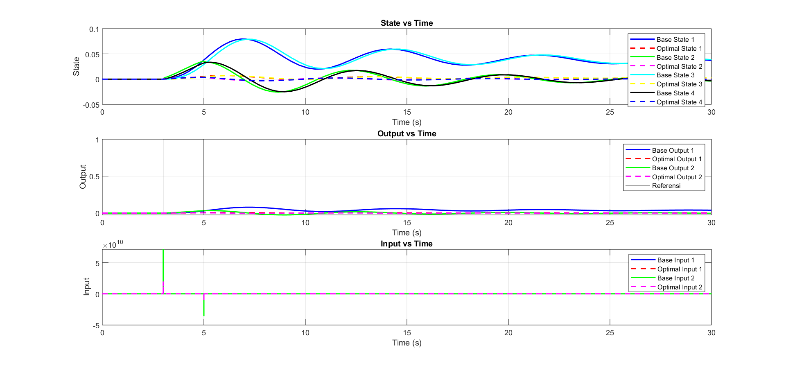

# Active Quarter-Car Suspension: Analysis & Control


State-space modelling of a 2-DOF active quarter-car suspension using **BMW 530i** parameters, a controllability/observability analysis, and a comparison of several LQR-based control strategies: **LQR**, **LQR-PID**, and the **Internal Model Principle (IMP)**. The $Q$ and $R$ weights are tuned automatically with a **Genetic Algorithm (GA)**. **Pontryagin's Maximum Principle (PMP)** and **Reinforcement Learning (RL)** approaches are work in progress.

> Course project for **TF4108 Machine Learning for Control**, Engineering Physics, Institut Teknologi Bandung (2024).
> Achriza Nurfarid (13321023) · Izma Alhazmi Herdian (13321027) · Ilham Bintang (13321047)

<p align="center">
  
</p>

---

## Table of Contents

1. [Repository Structure](#repository-structure)
2. [System Modelling](#1-system-modelling)
3. [Open-Loop Analysis](#2-open-loop-analysis)
4. [Control Methods](#3-control-methods)
5. [Results](#4-results)
6. [Getting Started](#5-getting-started)
7. [Notes & Limitations](#6-notes--limitations)
8. [References](#7-references)

---

## Repository Structure

```
AnalysisQuarterCarSuspension/
├── 01_LQR/              # Baseline LQR vs GA-tuned LQR
│   ├── FindLQR.m        #   main script: model → GA → lqr() → Simulink simulation → plots
│   ├── GA.m             #   Simulink-free version (ode45) + stability validation
│   └── CariLQR.slx      #   Simulink model
├── 03_LQR_PID/          # MIMO-PID tuned from LQR gains (integral augmentation)
│   ├── FindLQR_PID.m
│   └── CariLQR_PID.slx
├── 04_PMP/              # Pontryagin's Maximum Principle (WIP)
│   ├── FindPMP.m
│   └── CariPMP.slx
├── 05_IMP/              # Internal Model Principle + LQR
│   ├── FindIMP.m
│   └── CariIMP.slx
├── 06_RL/               # Reinforcement Learning (WIP, Simulink model only)
│   └── FindRL.slx
├── docs/
│   ├── Report.pdf       # full report (modelling, observability, LQR), in Indonesian
│   ├── images/          # all figures used in this README
│   └── scripts/
│       └── generate_figures.py   # regenerates the README illustrations
└── references/          # reference papers & lecture material
```

---

## 1. System Modelling

### 1.1 Equations of motion

The system consists of the body mass $m_c$ (*sprung mass*) and the wheel mass $m_{us}$ (*unsprung mass*), connected by a spring $k_r$, a damper $b_r$, and an actuator $F_a$. The wheel contacts the road through the tire stiffness $k_k$ and is excited by the road profile $u(t)$. From Newton's second law:

```math
\begin{aligned}
m_{us}\,\ddot y_k &= k_k\,(u - y_k) - k_r\,(y_k - y_c) - b_r\,(\dot y_k - \dot y_c) - F_a \\
m_c\,\ddot y_c &= k_r\,(y_k - y_c) + b_r\,(\dot y_k - \dot y_c) + F_a
\end{aligned}
```

### 1.2 State-space representation

With the state and input vectors

```math
x = \begin{bmatrix} x_1 \\ x_2 \\ x_3 \\ x_4 \end{bmatrix}
  = \begin{bmatrix} y_k \\ \dot y_k \\ y_c \\ \dot y_c \end{bmatrix},
\qquad
\mathbf{u} = \begin{bmatrix} F_a \\ u \end{bmatrix}
```

the system becomes $\dot x = Ax + B\mathbf{u}$, $\;y = Cx + D\mathbf{u}$, where

```math
A = \begin{bmatrix}
0 & 1 & 0 & 0 \\[2pt]
-\dfrac{k_k + k_r}{m_{us}} & -\dfrac{b_r}{m_{us}} & \dfrac{k_r}{m_{us}} & \dfrac{b_r}{m_{us}} \\[8pt]
0 & 0 & 0 & 1 \\[2pt]
\dfrac{k_r}{m_c} & \dfrac{b_r}{m_c} & -\dfrac{k_r}{m_c} & -\dfrac{b_r}{m_c}
\end{bmatrix},
\quad
B = \begin{bmatrix}
0 & 0 \\[2pt]
-\dfrac{1}{m_{us}} & \dfrac{k_k}{m_{us}} \\[8pt]
0 & 0 \\[2pt]
\dfrac{1}{m_c} & 0
\end{bmatrix},
\quad
C = \begin{bmatrix} 0 & 0 & 1 & 0 \\ 0 & 0 & 0 & 1 \end{bmatrix}
```

The controlled outputs are the body displacement and velocity ($y_c$, $\dot y_c$), since these determine passenger ride comfort.

### 1.3 Parameters (BMW 530i)

| Parameter | Symbol | Front | Rear | Unit |
|---|:---:|---:|---:|:---:|
| Suspension spring stiffness | $k_r$ | 30 | 31.5 | kN/m |
| Suspension damping coefficient | $b_r$ | 1450 | 4000 | N·s/m |
| Tire stiffness | $k_k$ | 340 | 340 | kN/m |
| Body mass (¼ vehicle) | $m_c$ | 408 | 400 | kg |
| Wheel mass | $m_{us}$ | 48.3 | 45 | kg |

All simulations use the **front** parameters. In SI units the numerical matrices are:

```math
A = \begin{bmatrix}
0 & 1 & 0 & 0 \\
-7660.46 & -30.02 & 621.12 & 30.02 \\
0 & 0 & 0 & 1 \\
73.53 & 3.55 & -73.53 & -3.55
\end{bmatrix},
\qquad
B = \begin{bmatrix}
0 & 0 \\
-0.0207 & 7039.34 \\
0 & 0 \\
0.00245 & 0
\end{bmatrix}
```

---

## 2. Open-Loop Analysis

### 2.1 Stability & vibration modes

The eigenvalues of $A$ show the two lightly damped oscillatory modes typical of a vehicle suspension:

| Mode | Pole $\lambda$ | $\omega_n$ | $f_n$ | $\zeta$ |
|---|:---:|:---:|:---:|:---:|
| Body bounce | $-1.51 \pm 8.13j$ | 8.27 rad/s | **1.32 Hz** | 0.18 |
| Wheel hop | $-15.27 \pm 85.67j$ | 87.0 rad/s | **13.85 Hz** | 0.18 |

All poles lie in the left half-plane ($\mathrm{Re}\{\lambda_i\}<0$), so the system is **stable**. However, the damping ratio is only about 0.18, so the response oscillates with roughly 60% overshoot.

### 2.2 Controllability & observability

```math
\mathcal{C} = \begin{bmatrix} B & AB & A^2B & A^3B \end{bmatrix},
\qquad
\mathcal{O} = \begin{bmatrix} C \\ CA \\ CA^2 \\ CA^3 \end{bmatrix}
```

Using only the actuator input $F_a$ and only the output $y_c$ ($C=[0\;0\;1\;0]$):

```math
\mathcal{C}_{F_a} =
\begin{bmatrix}
0 & -0.0207 & 0.6951 & 136.79 \\
-0.0207 & 0.6951 & 136.79 & -9450.66 \\
0 & 0.00245 & -0.0823 & 1.0603 \\
0.00245 & -0.0823 & 1.0603 & 539.52
\end{bmatrix},
\qquad
\mathcal{O}_{y_c} =
\begin{bmatrix}
0 & 0 & 1 & 0 \\
0 & 0 & 0 & 1 \\
73.53 & 3.55 & -73.53 & -3.55 \\
-27485.98 & -45.79 & 2468.72 & 45.79
\end{bmatrix}
```

$\mathrm{rank}(\mathcal{C}) = \mathrm{rank}(\mathcal{O}) = 4 = n$. The system is therefore **controllable** (the actuator $F_a$ alone is enough) and **observable** (measuring $y_c$ alone is enough), so full-state feedback is feasible.

---

## 3. Control Methods

### 3.1 Linear Quadratic Regulator (LQR) — [`01_LQR/`](01_LQR)

<p align="center"></p>

LQR finds the control law $u = -Kx$ that minimises the quadratic performance index

```math
J = \int_0^{\infty} \left( x^{T} Q\, x + u^{T} R\, u \right) dt ,
\qquad Q \succeq 0,\; R \succ 0
```

The solution follows from the **Algebraic Riccati Equation (ARE)**:

```math
A^{T}P + PA - PBR^{-1}B^{T}P + Q = 0
\quad\Longrightarrow\quad
K = R^{-1}B^{T}P,
\qquad J^{*} = x_0^{T} P\, x_0
```

$Q$ penalises state deviation and $R$ penalises control effort. A larger $Q/R$ ratio gives a more aggressive response at the cost of more control effort.

#### Tuning $Q$ & $R$ with a Genetic Algorithm

Instead of trial and error, the diagonals of $Q$ and $R$ are found with a GA (MATLAB `ga()`, 1000 generations, population 20, bounds $q_i\in[0.1,100]$, $r_i\in[0.01,10]$):

<p align="center"></p>

The GA cost combines the ISE (*integral squared error*) with penalties on the transient characteristics of each state, simulated from $x_0 = [1\;1\;1\;1]^T$ for 10 s:

```math
J_{GA} = \int_0^{10} \lVert x(t) \rVert^2 \, dt
\;+\; \sum_{i} \mathrm{OS}_i
\;+\; \sum_{i} t_{s,i}
\;+\; 100 \sum_{i} \lvert e_{ss,i} \rvert
```

where $\mathrm{OS}_i$ is the overshoot (%), $t_{s,i}$ the 2% settling time, and $e_{ss,i}$ the steady-state error of state $i$.

### 3.2 LQR-PID — [`03_LQR_PID/`](03_LQR_PID)

<p align="center"></p>

A MIMO PID controller is tuned from the LQR solution (He *et al.*, 2000; Kaci *et al.*, 2019). The plant is augmented with integrators on the inputs (*backstepping integral augmentation*):

```math
\tilde A = \begin{bmatrix} A & B \\ 0 & 0 \end{bmatrix},\quad
\tilde B = \begin{bmatrix} 0 \\ I \end{bmatrix},\quad
\Gamma = \begin{bmatrix} C & 0 \\ CA & CB \\ CA^2 & CAB \end{bmatrix}
```

The LQR gain $K$ of $(\tilde A,\tilde B,Q,R)$ is mapped to the output space as $\hat K = K\,\Gamma^{+}$ and split into $\hat K = [\hat K_1\;\hat K_2\;\hat K_3]$ to obtain the PID gains:

```math
K_d = \frac{\hat K_3}{1 + \hat K_3\,CB}, \qquad
K_p = \hat K_2\,(1 - K_d\,CB), \qquad
K_i = \hat K_1\,(1 - K_d\,CB)
```

$Q$ (6×6) and $R$ (2×2) are also tuned with the GA, as in 3.1.

### 3.3 Internal Model Principle (IMP) + LQR — [`05_IMP/`](05_IMP)

<p align="center"></p>

By the *Internal Model Principle*, zero steady-state error in tracking or disturbance rejection is achieved when a model of the reference/disturbance generator is embedded in the loop. A second-order compensator with eigenvalues $\{-1,\,0\}$ (containing an integrator mode) is built in controllable canonical form:

```math
A_a = \begin{bmatrix} 0 & 1 \\ -a_0 & -a_1 \end{bmatrix},\quad
B_a = \begin{bmatrix} 0 & 0 \\ 1 & 1 \end{bmatrix},\quad
C_a = \begin{bmatrix} 1 & 1 \\ 1 & 1 \end{bmatrix},\quad
s^2 + a_1 s + a_0 = s(s+1)
```

The augmented 6-state system is then stabilised with LQR (GA-tuned weights):

```math
\begin{bmatrix} \dot x_p \\ \dot x_a \end{bmatrix}
= \underbrace{\begin{bmatrix} A_p & B_pC_a \\ 0 & A_a \end{bmatrix}}_{A}
\begin{bmatrix} x_p \\ x_a \end{bmatrix}
+ \underbrace{\begin{bmatrix} 0 \\ B_a \end{bmatrix}}_{B} v,
\qquad v = -K \begin{bmatrix} x_p \\ x_a \end{bmatrix}
```

### 3.4 Pontryagin's Maximum Principle (PMP) — [`04_PMP/`](04_PMP) *(WIP)*

Optimal control formulated through the Hamiltonian:

```math
H(x,u,\lambda) = \tfrac12\left(x^{T}Qx + u^{T}Ru\right) + \lambda^{T}(Ax + Bu)
```

```math
\dot x = \frac{\partial H}{\partial \lambda},\qquad
\dot \lambda = -\frac{\partial H}{\partial x} = -Qx - A^{T}\lambda,\qquad
\frac{\partial H}{\partial u} = 0 \;\Rightarrow\; u^{*} = -R^{-1}B^{T}\lambda
```

The Simulink model `CariPMP.slx` exists, but `FindPMP.m` so far only defines the model and the $Q$, $R$, $P$ weights.

### 3.5 PID & Reinforcement Learning *(planned)*

`06_RL/FindRL.slx` is only a Simulink skeleton so far. A pure PID controller has not been implemented yet.

---

## 4. Results

### 4.1 LQR vs uncontrolled system (step response)

A reproduction of the analysis in [`docs/Report.pdf`](docs/Report.pdf) with $Q=\mathrm{diag}(10,1,10,1)$ and $R=\mathrm{diag}(100,100)$:

<p align="center"></p>

| Step input → $y_c$ | System | Overshoot | Settling time (2%) | Final value |
|---|---|:---:|:---:|:---:|
| Road profile $u$ (1 m) | Uncontrolled | 60.9 % | 2.39 s | 1.000 m |
| | **LQR** | **18.1 %** | **0.99 s** | 0.913 m |
| Force $F_a$ (1 N) | Uncontrolled | 55.6 % | 2.43 s | 0.0333 mm |
| | **LQR** | **22.6 %** | **0.96 s** | 0.0342 mm |

LQR cuts the overshoot by about 3× and settles about 2.4× faster. There is a small offset in the final value because pure LQR has no integral action. This offset motivates the **LQR-PID** and **IMP** approaches.

### 4.2 Pole placement

<p align="center"></p>

The dominant body poles move from $-1.51 \pm 8.13j$ ($\zeta = 0.18$) to $-3.60 \pm 8.04j$ ($\zeta = 0.41$). The natural frequency stays almost the same, but the damping more than doubles. The wheel-hop mode becomes two real poles (−10.5 and −694).

### 4.3 Road-vibration transmissibility

<p align="center"></p>

LQR removes the body resonance peak (~1.3 Hz, from +9.4 dB to ≈0 dB) and the wheel resonance (~14 Hz, from −19 dB to −46 dB). In the 4–8 Hz band, to which the human body is most sensitive (ISO 2631), the vibration transmitted to the body drops by about 9–17 dB.

### 4.4 Effect of the $Q$ and $R$ weights

<p align="center"></p>

- Increasing $Q$ (or decreasing $R$) makes the controller **more aggressive**: overshoot drops and oscillations die out faster, but the offset grows and more control effort is needed.
- Only the **ratio** $Q/R$ matters. This is why the pairs $\{Q=\mathrm{diag}(0.1,0.01,0.1,0.01),\,R=I\}$ and $\{Q=\mathrm{diag}(10,1,10,1),\,R=100I\}$ in the report give similar plots.

### 4.5 GA optimisation results (Simulink)

In the three plots below, the disturbance is a unit pulse from $t = 3\text{–}5$ s (like driving over a speed bump). **Solid lines = baseline** ($Q=I$, $R=I$); **dashed lines = GA-tuned weights**.

**LQR vs LQR-GA** (`01_LQR/FindLQR.m`)
<p align="center"></p>

The GA-tuned weights reduce the peak body displacement from ≈0.5 to ≈0.25 (about −50%). Post-disturbance state oscillations are also smaller, with comparable control effort.

**LQR-PID vs LQR-PID-GA** (`03_LQR_PID/FindLQR_PID.m`)
<p align="center"></p>

The baseline LQR-PID oscillates slowly and has not settled within 30 s. The GA version keeps the state deviations close to zero. The input spikes ($\sim\!10^{10}$) come from the derivative action acting on the discontinuous pulse edges. A derivative filter ($N$) is needed to make this realistic.

**IMP vs IMP-GA** (`05_IMP/FindIMP.m`)
<p align="center"></p>

IMP brings the output back to zero with no steady-state error after the disturbance. The GA version is slightly faster, but with a higher input peak (≈3 vs ≈1.3).

---

## 5. Getting Started

### MATLAB

Requires **MATLAB R2023b** (or newer) with the following toolboxes:

| Toolbox | Used for |
|---|---|
| Simulink | `Cari*.slx` models |
| Control System Toolbox | `lqr`, `ss` |
| Global Optimization Toolbox | `ga` |
| Symbolic Math Toolbox | `jordan` (IMP) |

```matlab
cd 01_LQR
FindLQR        % GA → LQR → simulate CariLQR.slx → plots
```

Run `03_LQR_PID/FindLQR_PID.m` and `05_IMP/FindIMP.m` the same way from their own folders. Each script calls the Simulink model in the same folder, so **MATLAB's current folder must be that folder**.

> The GA runs for up to 1000 generations, which can take a long time. Lower `MaxGenerations` for a quick test. The GA is also stochastic; add `rng(0)` at the top of a script to make results reproducible.

### README figures (Python)

```bash
pip install numpy scipy matplotlib
python docs/scripts/generate_figures.py
```

This regenerates the illustrations (schematic, block diagrams, step response, pole map, Bode plot, Q/R sweep). It also prints the controllability/observability matrices, poles, and the gain $K$ to the terminal.

---

## 6. Notes & Limitations

- **Stiffness units in the MATLAB scripts.** In every `Find*.m`, `kk = 340` and `kr = 30` are commented as *kN/m* but used directly as N/m (not multiplied by 1000). The analysis in `docs/Report.pdf` and the Python figures in this README use SI units (`340e3`, `30e3`). As a result, the GA results in section 4.5 come from a model whose stiffnesses are 1000× too small. Use `kk = 340e3; kr = 30e3;` to be consistent with the report.
- **Both inputs are treated as control inputs.** The gain $K \in \mathbb{R}^{2\times4}$ is computed for $[F_a;\,u]$, even though the road profile $u$ is physically an uncontrollable disturbance. A more realistic formulation uses $B_1$ (actuator) as the control input and $B_2$ as the disturbance input.
- **Full-state feedback** assumes all four states are measured. A real implementation needs an observer (e.g. a Kalman filter/LQG), which is possible because the system is observable.
- `04_PMP` and `06_RL` are not finished yet.

---

## 7. References

PDFs are available in the [`references/`](references) folder.

1. K. Á. Kis *et al.*, "Quarter Car Suspension State Space Model and Full State Feedback Control for Real-Time Processing," *SPSympo*, 2023. doi:10.23919/SPSympo57300.2023.10302720
2. A. A. Ahmed *et al.*, "Modeling and Control of a Half Car Active Suspension System using Sliding Mode Controller and Linear Quadratic Regulator Controller," *ieCRES*, 2023. doi:10.1109/ieCRES57315.2023.10209435
3. J.-B. He, Q.-G. Wang, T.-H. Lee, "PI/PID controller tuning via LQR approach," *Chemical Engineering Science*, 55, 2000.
4. A. Kaci *et al.*, "LQR based MIMO-PID controller for the vector control of an underdamped harmonic oscillator," *Mechanical Systems and Signal Processing*, 2019.
5. E. V. Kumar, J. Jerome, "LQR based Optimal Tuning of PID Controller for Trajectory Tracking of Magnetic Levitation System," *Procedia Engineering*, 64, 2013.
6. R. Guardeño, M. J. López, V. M. Sánchez, "MIMO PID Controller Tuning Method for Quadrotor Based on LQR/LQG Theory," *Robotics*, 8(2), 2019.
7. C. Choubey, J. Ohri, "Tuning of LQR-PID controller to control parallel manipulator," *Neural Computing and Applications*, 34, 2022.
8. X. Chen, *Canonical Forms of State-Space Systems*, ME547 Linear Systems, University of Washington.
9. Lecture notes: *Pontryagin's Maximum Principle*.
